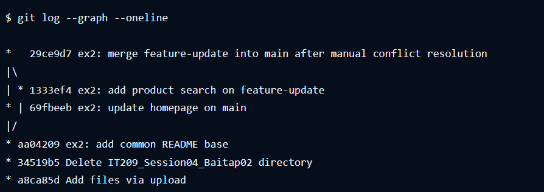

# Báo cáo bài tập 2 — Branch và Merge Conflict

## 1. Tạo nhánh và gây xung đột

Thực hiện tại thư mục gốc repository. File thực hành là `homework/session_04/ex2/README.md`.

1. Trên `main`, tạo README có dòng `Tính năng: Phiên bản cơ bản.`, sau đó `git add homework/session_04/ex2/README.md` và `git commit -m "ex2: add common README base"`. Commit chung: `aa04209`.
2. Chạy `git switch -c feature-update`. Sửa dòng trên thành `Tính năng: Bổ sung tìm kiếm sản phẩm.`, add và commit. Commit nhánh tính năng: `1333ef4`.
3. Chạy `git switch main`. Sửa cùng dòng thành `Tính năng: Cải thiện giao diện trang chủ.`, add và commit. Commit nhánh chính: `69fbeeb`.
4. Chạy `git -c rerere.enabled=false -c merge.conflictStyle=merge merge --no-ff --no-commit feature-update`. Git báo `CONFLICT (content)` và dừng để xử lý. Không dùng tùy chọn tự chọn ours/theirs hay công cụ giải quyết tự động. `--no-commit` dừng trước khi commit; chính việc sửa khác nhau trên cùng dòng gây ra xung đột.

## 2. Xử lý thủ công

README tại thời điểm xung đột chứa:

```text
<<<<<<< HEAD
Tính năng: Cải thiện giao diện trang chủ.
=======
Tính năng: Bổ sung tìm kiếm sản phẩm.
>>>>>>> feature-update
```

Phần trên dấu `=======` là nội dung `main` đang checkout; phần dưới là nội dung nhánh `feature-update`. Sửa trực tiếp khối này trong file: xóa ba dòng đánh dấu, thay hai phương án bằng một dòng kết hợp:

```text
Tính năng: Cải thiện giao diện trang chủ và bổ sung tìm kiếm sản phẩm.
```

Sau đó chạy:

```bash
git diff --check
git add homework/session_04/ex2/README.md
git commit -m "ex2: merge feature-update into main after manual conflict resolution"
git log --graph --oneline
```

`git add` ghi nhận nội dung đã giải quyết. `git commit` hoàn tất lần merge đang dở, tạo commit `29ce9d7`; đây là merge commit thật, không phải squash.

## 3. Cơ chế 3-Way Merge

Git so sánh ba phiên bản: **base** là tổ tiên chung `aa04209`, **ours** là `main` tại `69fbeeb`, **theirs** là `feature-update` tại `1333ef4`. Cả hai nhánh đều sửa cùng dòng của base theo cách khác nhau nên Git không tự chọn được nội dung.

Trong lúc xung đột, `git ls-files -u` hiển thị ba stage cho README: stage 1 là base, stage 2 là ours và stage 3 là theirs. Sau khi chỉnh file và add, các stage xung đột được thay bằng bản đã giải quyết. Ba phiên bản này là đầu vào của 3-Way Merge; không phải ba vùng working directory, staging area và repository.

## 4. Kiểm tra lịch sử

Merge commit: `29ce9d754ee80dae0fa45dcbc981bd8f5c727f7b`.

Hai commit cha, theo thứ tự:

- `69fbeebb2acb3f2d3d5d0fb0ea1cc727d439bdcd` — main trước merge.
- `1333ef4c46cfe6375965d93ebcdaeac8720496c9` — feature-update.

Kiểm tra bằng `git show -s --format="%H%n%P" 29ce9d7` và `git log --graph --oneline`. Lịch sử thể hiện nhánh tính năng tách từ `aa04209` và nhập lại tại `29ce9d7`. Commit bổ sung báo cáo/ảnh sau đó không thay đổi cấu trúc merge này.



Ảnh trên do người dùng cung cấp, hiển thị đầu ra `git log --graph --oneline` tại thời điểm ngay sau merge. Đầu ra cũng được lưu trong `git-log-graph.txt` để đối chiếu.
